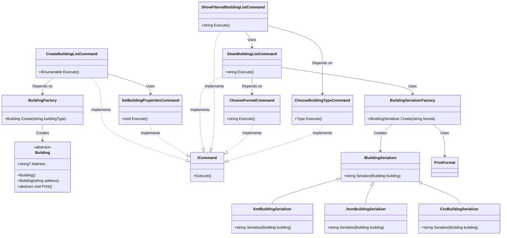

```mermaid
classDiagram
    class Building {
        <<abstract>>
        +string? Address
        +Building()
        +Building(string address)
        +abstract void Print()
    }

    class BuildingFactory {
        +Building Create(string buildingType)
    }

    class CreateBuildingListCommand {
        +IEnumerable<Building> Execute()
    }

    class SetBuildingPropertiesCommand {
        +void Execute()
    }

    class ShowBuildingListCommand {
        +string Execute()
    }

    class ShowFilteredBuildingListCommand {
        +string Execute()
    }

    class BuildingSerializerFactory {
        +IBuildingSerializer Create(string format)
    }

    class XmlBuildingSerializer {
        +string Serialize(Building building)
    }

    class JsonBuildingSerializer {
        +string Serialize(Building building)
    }

    class CsvBuildingSerializer {
        +string Serialize(Building building)
    }

    class ChooseFormatCommand {
        +string Execute()
    }

    class ChooseBuildingTypeCommand {
        +Type Execute()
    }

    class ICommand {
        +Execute()
    }

    class IBuildingSerializer {
        +string Serialize(Building building)
    }

    BuildingFactory --> Building : Creates
    CreateBuildingListCommand --> BuildingFactory : Depends on
    CreateBuildingListCommand --> SetBuildingPropertiesCommand : Uses
    CreateBuildingListCommand ..|> ICommand : Implements
    SetBuildingPropertiesCommand ..|> ICommand : Implements
    ShowBuildingListCommand --> ChooseFormatCommand : Depends on
    ShowBuildingListCommand --> BuildingSerializerFactory : Uses
    ShowBuildingListCommand ..|> ICommand : Implements
    ShowFilteredBuildingListCommand ..|> ICommand : Implements
    ShowFilteredBuildingListCommand --> ShowBuildingListCommand : Uses
    ShowFilteredBuildingListCommand --> ChooseBuildingTypeCommand : Depends on
    ChooseFormatCommand ..|> ICommand : Implements
    ChooseBuildingTypeCommand ..|> ICommand : Implements
    BuildingSerializerFactory --> IBuildingSerializer : Creates
    IBuildingSerializer <|-- XmlBuildingSerializer
    IBuildingSerializer <|-- JsonBuildingSerializer
    IBuildingSerializer <|-- CsvBuildingSerializer
    BuildingSerializerFactory --> PrintFormat : Uses

```